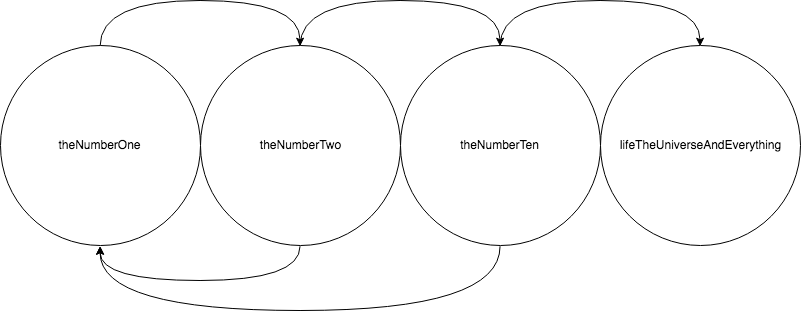

# React Machinery

[]()
[]()
[]()


⚙️ State Machine Modelling for React

- [Description](#description)
  - [Examples](#examples)
- [Installation](#installation)
- [API](#api)
  - [StateMachine](#statemachine)
    - [getCurrentState](#getcurrentstate)
    - [setNewState](#setnewstate)
    - [states](#states)
    - [data](#data)

## Description

🔥 `React Machinery` provides a simple to use, component based approach to state machines in react.

Describe your states, transitions, and which component each renders, and plug it into the `StateMachine` component. It accepts two extra functions; one for getting the current state name and one for setting it. This allows your app to flexibly use and swap out different ways of storing data - be it in component state, redux, mobx, whatever.

### Examples

Examples of how the following state diagram can be implemented in both vanilla react and using redux can be found in the examples folder.

- [Example using react](examples/1.Normal-Component-State.js)
- [Example using redux](examples/2.With-Redux.js)



## Installation

```bash
# with yarn
yarn add react-machinery

# or with npm
npm i react-machinery
```

## API

### StateMachine

All props for the `StateMachine` component are required.

#### getCurrentState

##### function()

A function returning the current state name, stored somewhere like a react component state, or in redux.

#### setNewState

##### function(newStateName)

A function that updates the current state, stored somewhere like a react component state, or in redux.

#### states

##### Array of state definitions

A state definition is a plain javascript object with the following properties:

```javascript
{
  // This name corresponds to the one coming from getCurrentState() and
  // being set by setNewState()
  name: 'State Name',

  // Array of plain objects that describe transitions
  transitions: [
    // A transition object must contain two properties:
    // test, which is a function that recieves the StateMachine data, and returns true if a state change should take place
    // newState, which is the name of the state to transition to when the test function returns true
    {
      test: data => data === 'expected for state change',
      newState: 'Name of new state'
    }
  ],

    // One of the following two properties must be implemented:

  // a render prop that recieves the name of the current state as an argument
  // The second argument passes the 'props' object supplied to the StateMachine
  render: (currentState, additionalProps) => {
    return <SomeComponent propUsingStateName={currentState} {...additionalProps} />
  },

  // Or just a regular react component
  component: SomeReactComponent
}
```

#### data

##### any

Any kind of data that defines all the states in the state machine.

#### props

##### object

These props are supplied to the component rendered by any state. If a render prop is used for the state, then the props are passed as the second argument.